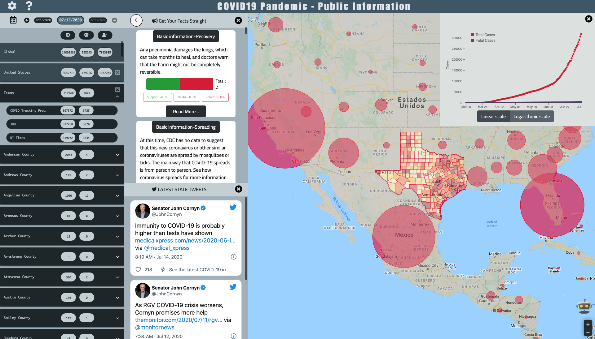

# IDIR COVID19 Dashboard

[IDIR Lab](http://idir.uta.edu/)| [Online Dashboard](https://idir.uta.edu/covid-19) | [Data API](https://idir.uta.edu/covid-19-api)

## About

[Our project](https://cokn.org/) aims to understand the surveillance of, impact of and intervention on [COVID-19 misinfodemic on Twitter](https://abcnews.go.com/US/spreading-covid-19-misinformation/story?id=70615995). Specifically, it introduces a public dashboard which, in addition to displaying case counts in an interactive map and a navigational panel, also provides some unique features not found in other places. Particularly, the dashboard uses a curated catalog of COVID-19 related facts and debunks of misinformation, and it displays the most prevalent information from the catalog among Twitter users in user-selected U.S. geographic regions.

## Data Source

- [Johns Hopkins University](https://github.com/CSSEGISandData/COVID-19)
- [New York Times](https://github.com/nytimes/covid-19-data)
- [COVID Tracking Project](https://covidtracking.com/api/)

## Contributors

- [Josue Caraballo](https://github.com/v3nd3774)
- [Kevin Meng](https://github.com/824zzy)
- [Haojin Liao](https://github.com/YapheeetS)
- [Zhengyuan Zhu](https://github.com/824zzy)

## License

[@MIT](./LICENSE)
